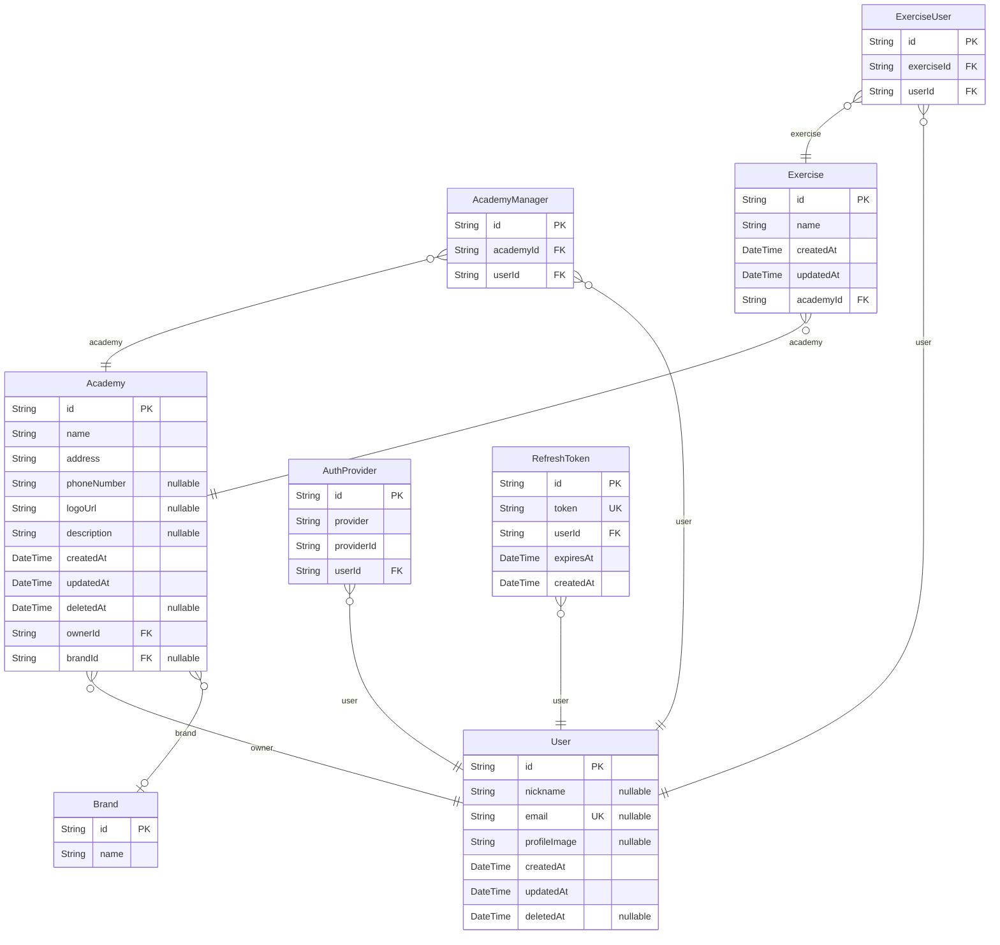

# backend-erd

> Generated by [`prisma-markdown`](https://github.com/samchon/prisma-markdown)

- [default](#default)

## default

### `User`

Properties as follows:

- `id`:
- `nickname`:
- `email`:
- `profileImage`:
- `createdAt`:
- `updatedAt`:
- `deletedAt`:

### `Brand`

Properties as follows:

- `id`:
- `name`:

### `Academy`

Properties as follows:

- `id`:
- `name`:
- `address`:
- `phoneNumber`:
- `logoUrl`:
- `description`:
- `createdAt`:
- `updatedAt`:
- `deletedAt`:
- `ownerId`:
- `brandId`:

### `AcademyManager`

Properties as follows:

- `id`:
- `academyId`:
- `userId`:

### `Exercise`

Properties as follows:

- `id`:
- `name`:
- `createdAt`:
- `updatedAt`:
- `academyId`:

### `ExerciseUser`

Properties as follows:

- `id`:
- `exerciseId`:
- `userId`:

### `AuthProvider`

Properties as follows:

- `id`:
- `provider`:
- `providerId`:
- `userId`:

### `RefreshToken`

Properties as follows:

- `id`:
- `token`:
- `userId`:
- `expiresAt`:
- `createdAt`:
